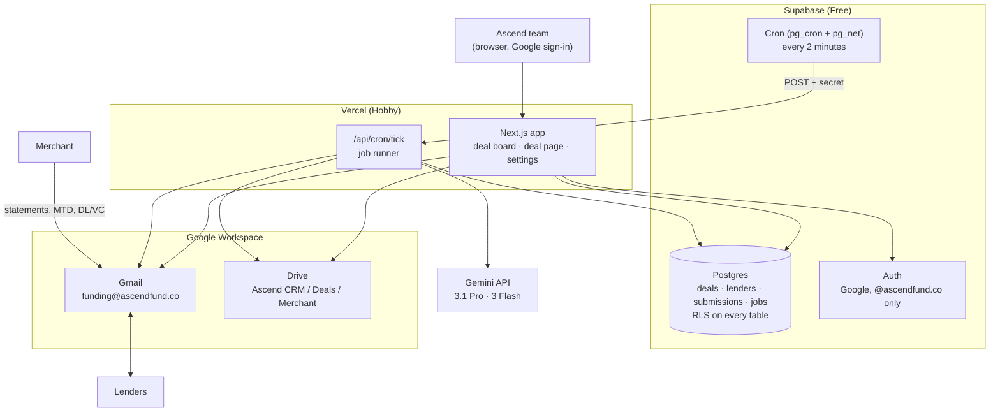
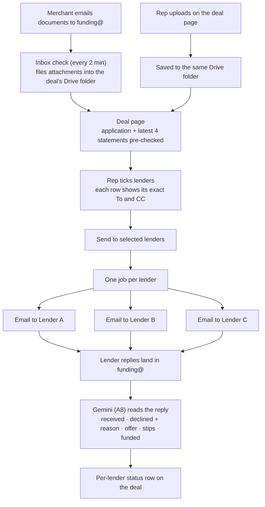
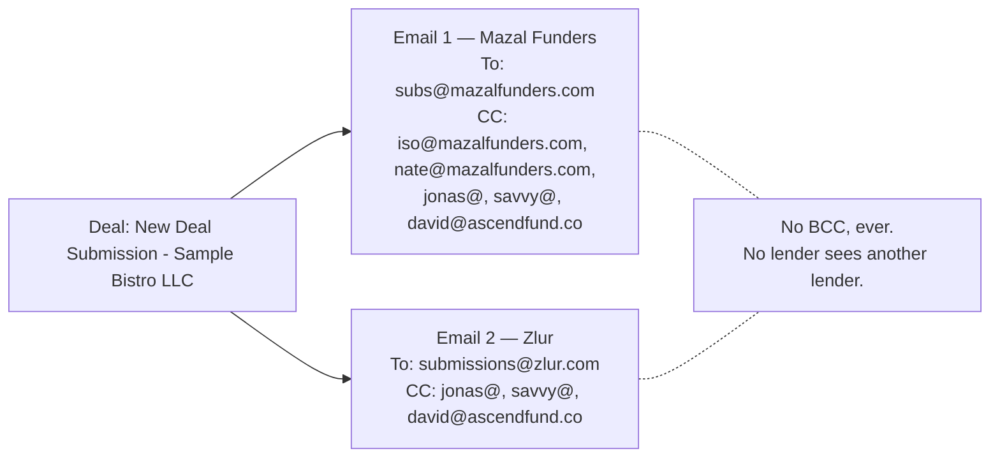
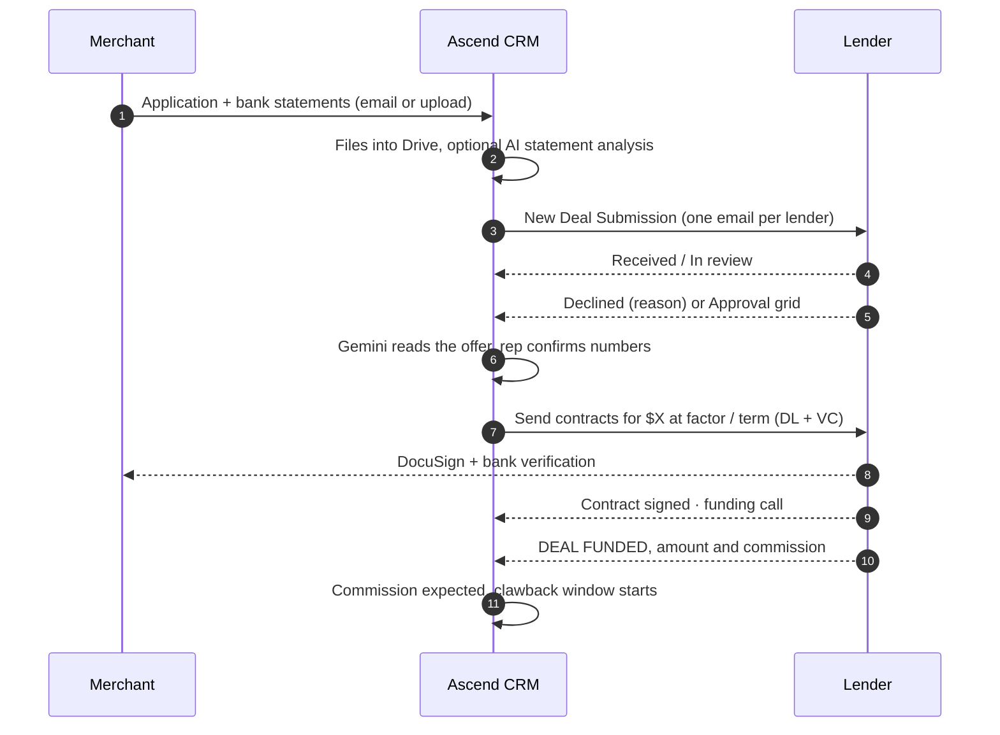
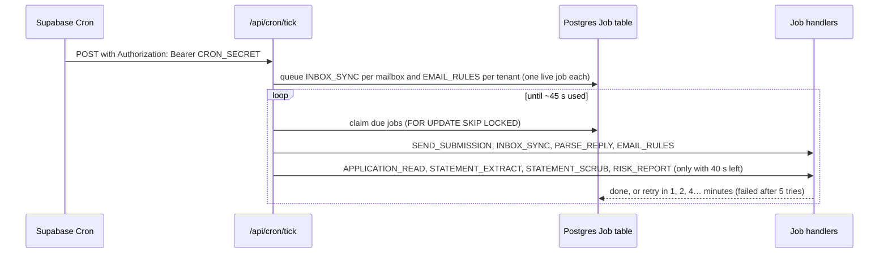
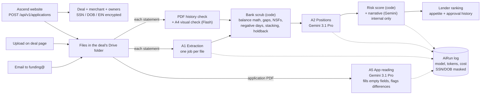
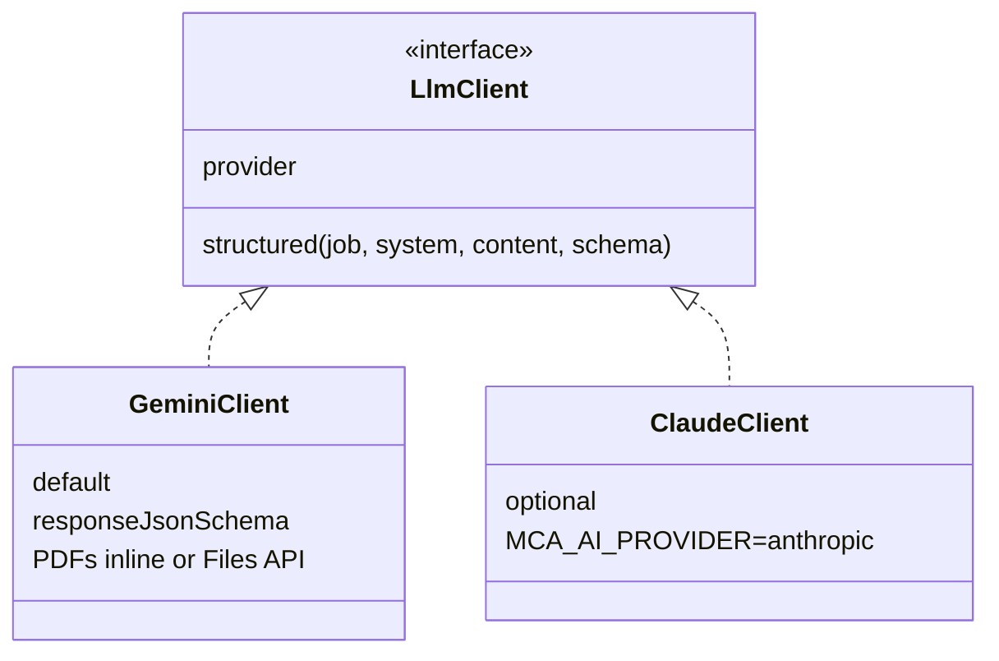

# How the Ascend CRM works

The CRM runs on free tiers: the app on **Vercel**, the database, sign-in and scheduler on
**Supabase**, files in **Google Drive**, email through the **Gmail** account
`funding@ascendfund.co`, and AI on the **Google Gemini API**. There is no phone or SMS part.

## 1. The pieces

## 2. Ship the file: one email per lender

How each email is addressed (example with two lenders from the roster):

Rules, all enforced in code (`packages/connectors/src/recipients.ts`):

- The lender's first address goes in **To**; its other addresses go in **CC**, then the team.
- Addresses are de-duplicated without regard to case; the sending mailbox is never copied.
- A lender with no address, or picked twice, stops the whole batch before anything is sent.
- A lender already sent this merchant is greyed out (backdoor and duplicate guard).
- Packages over 18 MB go as Drive links shared with that lender's addresses only.
- With `MCA_EMAIL_DRY_RUN` on (the default), the email is written to the deal timeline instead
  of being sent.

## 3. Deal lifecycle

## 4. Background work on free hosting

Vercel Hobby only runs crons once a day, so Supabase Cron calls the app every 2 minutes. Work is
kept in a `Job` table and each job is a small unit, so a call always finishes inside Vercel's
time limit. Clicking **Send** also runs the new jobs right away.

A send that crashes after Gmail accepted it is never sent twice: the job marks the submission
"sending" first, and a retry looks in Sent before trying again.

## 5. From application to Risk Report

The website posts each application to the CRM API (`docs/API.md`); statements can also arrive by
email or upload. Each file starts its own job, so nothing waits on a long request.

Lender replies go through A8 (Gemini 3 Flash) to update each lender's status row.

## 6. Watermarks and email automation

Every PDF in a lender's copy of the package is stamped on each page ("Submitted by Ascend Fund
to <Lender> only · date · Ref <tag>") and carries the tag in its metadata. The tag is stored on
that lender's submission, so a file that turns up elsewhere shows whose copy it was.

| Email                 | To                              | When                                   | Default                         |
| --------------------- | ------------------------------- | -------------------------------------- | ------------------------------- |
| Missing documents     | merchant                        | deal waiting on application/statements | automatic, up to 3, a day apart |
| Stip chase            | merchant                        | a lender asked for something           | automatic, up to 3, a day apart |
| Lender follow-up      | lender, same thread, same To/CC | no reply a day after sending           | automatic, once, weekdays       |
| Contract request      | lender, same thread             | rep clicks on an approved row          | one click, DL/VC attached       |
| Clawback confirmation | lender, same thread             | funded email asks for it               | one click                       |

All of them can be edited or turned off in Settings, skip merchants marked "no automated
emails", follow dry-run mode, and never use BCC.

The AI provider sits behind one interface, so Gemini can be swapped for Claude with one setting:

## Where things live in the code

| Concern                                      | Path                                                             |
| -------------------------------------------- | ---------------------------------------------------------------- |
| To/CC rules                                  | `packages/connectors/src/recipients.ts`                          |
| House email (subject, body, positions block) | `packages/connectors/src/funder/email.ts`                        |
| Gmail and Drive clients                      | `packages/connectors/src/email/gmail.ts`, `storage/drive.ts`     |
| Job queue                                    | `packages/db/src/jobs.ts`                                        |
| Background jobs (send, inbox, scrub, report) | `apps/web/src/server/jobs/`                                      |
| Website API                                  | `apps/web/src/app/api/v1/`, `docs/API.md`                        |
| Bank scrub checks, risk score, lender rank   | `packages/domain/src/scrub.ts`, `riskScore.ts`, `funderMatch.ts` |
| Watermark, PDF checks, report PDF            | `packages/connectors/src/pdf/`                                   |
| Email automation                             | `apps/web/src/server/email/`, `server/jobs/emailRules.ts`        |
| Deal page                                    | `apps/web/src/app/deals/[id]/`                                   |
| Gemini client                                | `packages/ai/src/providers/gemini.ts`                            |
| Database schema and RLS                      | `packages/db/prisma/`                                            |
